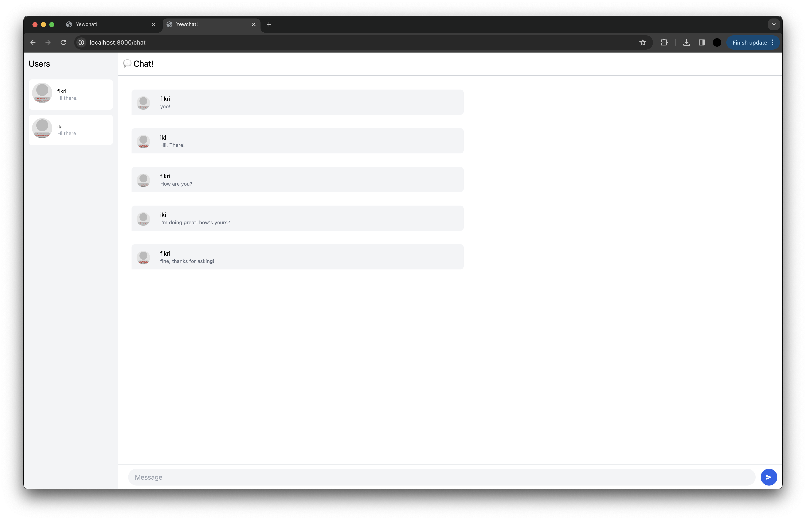
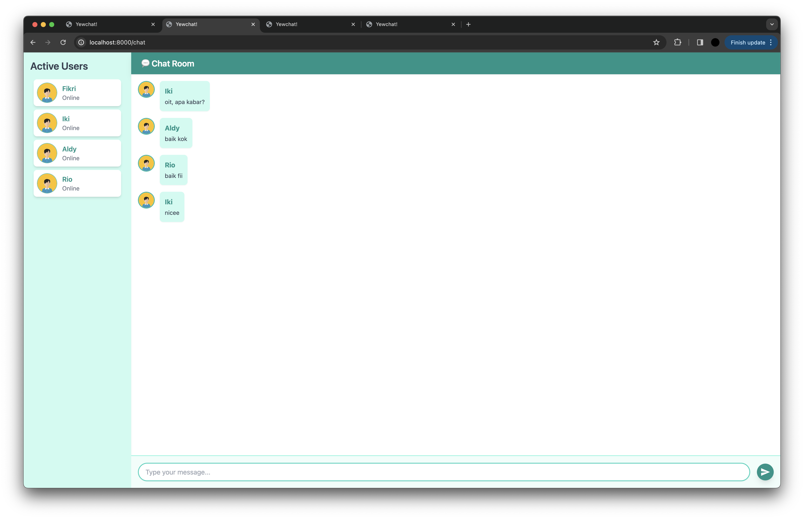

# Tutorial-10: YewChat 
## Fikri Dhiya Ramadhana
## 2206819533
## AdvProg-C

# YewChat 💬

> Source code for [Let’s Build a Websocket Chat Project With Rust and Yew 0.19 🦀](https://fsjohnny.medium.com/lets-build-a-websockets-project-with-rust-and-yew-0-19-60720367399f)

## Install

1. Install the required toolchain dependencies:
   ```npm i```

2. Follow the YewChat post!

## Branches

This repository is divided to branches that correspond to the blog post sections:

* main - The starter code.
* routing - The code at the end of the Routing section.
* components-part1 - The code at the end of the Components-Phase 1 section.
* websockets - The code at the end of the Hello Websockets! section.
* components-part2 - The code at the end of the Components-Phase 2 section.
* websockets-part2 - The code at the end of the WebSockets-Phase 2 section.

### Reflection
1. Screen Capture  


2. Be Creative!  
  
Changes:
   * Warna dan Gaya:  
   Mengubah skema warna dengan penggunaan kelas CSS seperti bg-teal-100 dan text-teal-600 agar terlihat bagus.
   * Struktur dan Layout:  
   Membuat pembagian ruang lebih terstruktur antara daftar pengguna dan area chat untuk organisasi yang lebih jelas.
   * Handling Pesan (Pesan & GIF):  
   Menambahkan gif handler yang lebih baik dengan menambahkan shadow-sm untuk tampilan yang lebih rapih.
   * Avatar URL:  
   Mengganti sumber avatar menjadi link statis dari svgrepo.com.
   * HTML dan JSX:  
   Menyempurnakan penggunaan kelas CSS untuk memberikan efek visual seperti shadow-md dan transition-shadow.
   * Input dan Tombol:  
   Menggunakan gaya focus:ring dan transition-colors untuk transisi visual.
   * Event Handler:  
   Menambahkan efek visual pada tombol dengan hover dan click untuk menunjukkan feedback saat interaksi pengguna.